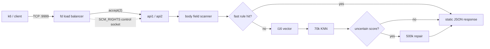

# rinha fraud

Fraud scoring for Rinha de Backend 2026, built around a tiny Rust runtime, a custom file-descriptor load balancer, and an approximate KNN index tuned for the public workload.

### quickstart

```bash
docker compose up --build
curl -i http://127.0.0.1:9999/ready
```

The Docker build downloads the official reference vectors and writes `/app/references.ridx` with the same bucket/IVF order used by the runtime.

### architecture

| stage | hot-path work | why it is shaped this way |
| --- | --- | --- |
| client to LB | TCP arrives on `:9999`; the LB accepts the socket and immediately chooses an API. | The LB stays transport-only and does not parse or score requests. |
| LB to API | The accepted client socket is passed with `SCM_RIGHTS` over a Unix control socket. | Avoids proxying bytes through the LB after accept, which cuts scheduler and copy overhead. |
| API parser | The API reads one HTTP message, scans only the needed JSON fields, and skips serde on the request path. | Fraud decisions only need a small subset of fields for the fast rule and vectorization. |
| fast decision | Obvious low-risk and high-risk cases return from body-level rules. | Keeps most requests away from KNN and returns one of six static response byte strings. |
| KNN fallback | Residual cases become compact `i16` vectors and search `70k` points, with targeted `500k` repair. | Keeps the common path short while preserving a deeper search for uncertain scores. |



The load balancer does not inspect requests and does not score fraud. Its only job is accepting client sockets and distributing those already-accepted file descriptors between the two API containers. After the transfer, the API talks directly to the client socket.

### scoring pipeline

1. Parse only the few JSON fields needed by the fast classifier.
2. Approve obvious low-risk amount/average-ratio cases.
3. Deny obvious high-risk amount, distance, velocity, installment, and hour cases.
4. Vectorize the residual request.
5. Search `70k` nearby reference points.
6. Repair uncertain scores through a `500k` fallback for scores `2`, `3`, `4`, plus a narrow score-`5` repair rule.

The final response is selected from six static byte strings. There is no dynamic JSON serialization in the endpoint.

### index

The index stores compact `i16` vectors ordered for scan locality:

| layer | layout | effect |
| --- | --- | --- |
| coarse bucket | flags, MCC, `tx_count_24h`, and amount/average-ratio | puts similar vectors into contiguous ranges before distance scoring starts |
| large-bucket IVF | sparse cells over the two most useful residual dimensions | reduces overscan only where buckets are large enough for the extra indirection to pay |
| hot columns | first two scan dimensions split out beside the point array | lets the distance loop cut off most candidates before loading the full `Point` |

The distance loop cuts early aggressively. Most candidates die in the first two dimensions, so the main cost is memory traffic rather than arithmetic.

### configuration

The compose defaults are tuned for the final 2 API + 1 LB topology:

| variable | default | purpose |
| --- | ---: | --- |
| `FAST_SEARCH_POINTS` | `70000` | first KNN limit |
| `REPAIR_SEARCH_POINTS` | `500000` | fallback KNN limit |
| `REPAIR_SCORES` | `234` | scores that trigger repair |
| `SCORE5_REPAIR_RULE` | `fp70narrow` | narrow score-5 repair |
| `IVF_GRID` | `1` | enables large-bucket IVF |
| `IVF_DIMS` | `2,4` | IVF dimensions baked into the image |
| `IVF_GLOBAL_PLAN` | `1` | globally ordered IVF scan plan |
| `LB_MODE` | `fd` | final load balancer mode |
| `FD_SOCKET_DIR` | `/sockets` | API control socket directory |
