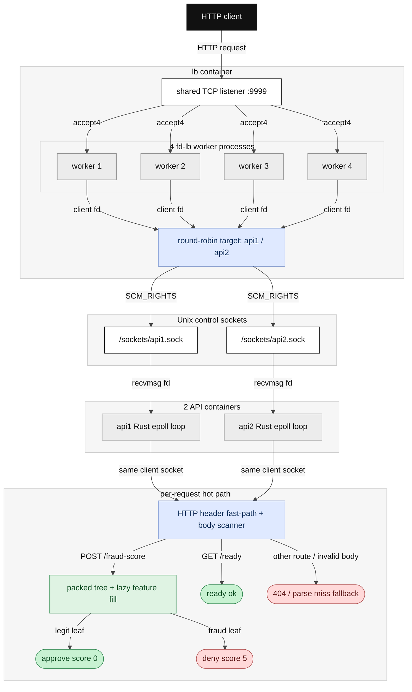

# rinha fraud

Fraud scoring for Rinha de Backend 2026, built around a tiny Rust runtime, a custom file-descriptor load balancer, and a locally generated decision tree.

### quickstart

```bash
docker compose up --build
curl -i http://127.0.0.1:9999/ready
```

### model generation

The runtime consumes a generated Rust tree committed at `src/tree_model.rs`. Rebuild it from labelled local data with:

```bash
python3 scripts/train_tree.py /tmp/rinha-resources/test-data.json src/tree_model.rs
```

The generator requires Python 3 with `numpy`. It extracts request features, trains a deterministic CART-style binary tree, and emits packed Rust nodes. The Docker image does not need the training data.

Diagram legend:

| class | use |
| --- | --- |
| `actor` | external caller |
| `edge` | listener, handoff socket, or boundary |
| `core` | runtime process or binary |
| `work` | request parsing and scoring work |
| `data` | generated model or training data |
| `endok` / `enderr` | terminal outcome |


### architecture

The compose topology is still the required **1 load balancer + 2 API containers**. The extra fan-out happens inside the LB container: `fd-lb` forks 4 lightweight worker processes that share the same TCP listener and distribute accepted client file descriptors between `api1` and `api2`.

| stage | hot-path work | key calls |
| --- | --- | --- |
| client to LB | The single LB container accepts TCP on `:9999`. | `accept4` |
| LB worker fan-out | 4 LB worker processes share the listener and choose `api1` or `api2`. | `fork`, round-robin |
| LB to API | The chosen worker passes the accepted client socket over a Unix control socket. | `sendmsg`, `SCM_RIGHTS` |
| API containers | 2 API containers receive FDs and keep the client socket. | `recvmsg`, `epoll_wait` |
| API parser | Read one HTTP message with a known-header fast-path, then scan only model fields. | `http_message_bounds_direct`, `parse_fast_fields` |
| decision tree | Fill features lazily while walking generated thresholds. | `predict_with_lazy_features` |
| response | Return one of two prebuilt HTTP responses. | `HTTP_SCORE0`, `HTTP_SCORE5` |



The load balancer does not inspect requests and does not score fraud. Its only job is accepting client sockets and distributing those already-accepted file descriptors between the two API containers. After the transfer, the chosen API talks directly to the original client socket.

### configuration

The compose defaults are tuned for the final 2 API + 1 LB topology:

| variable | default | purpose |
| --- | ---: | --- |
| `LB_MODE` | `fd` | final load balancer mode |
| `LB_WORKERS` | `4` | worker processes inside the single LB container |
| `FD_SOCKET_DIR` | `/sockets` | API control socket directory |
| `API_EPOLL` | `1` | epoll request loop |
| `API_WORKERS` | `192` | preallocated API worker capacity |
| `MLOCK_CURRENT` | `0` | optional memory locking |
