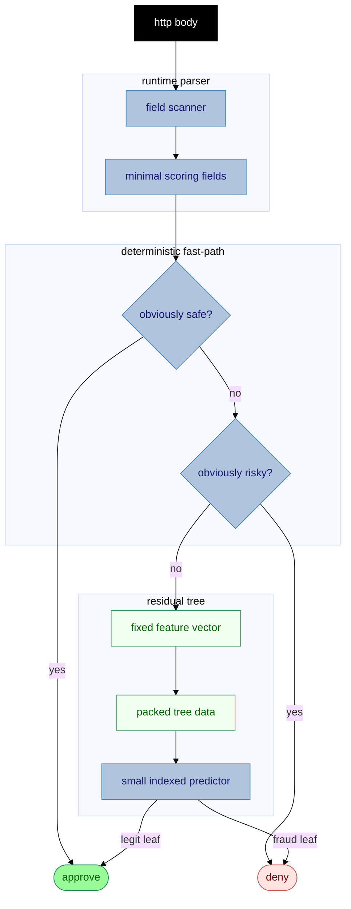
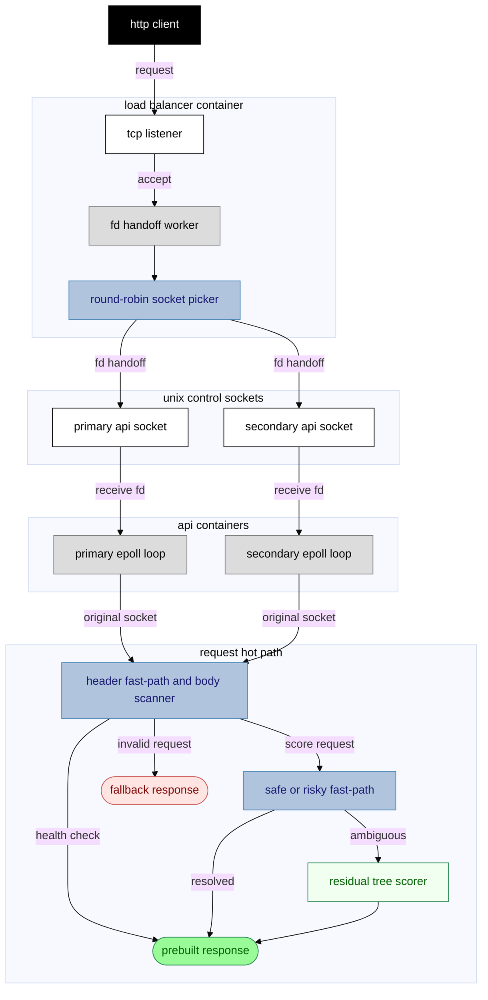

# rinha fraud

A compact Rust fraud scoring service built around a custom file descriptor load balancer, a hand-written request scanner, deterministic fast-path rules, and a generated residual decision tree.

## quickstart

```bash
docker compose up --build
```

## approach

The hot path is intentionally split into a cheap deterministic layer and a compact learned layer.

The deterministic layer scans only the fields needed for scoring and immediately handles obvious safe or risky requests. These checks are simple business-shaped predicates: familiar merchants, distance, purchase size, recent activity, and merchant category risk.

Requests that are not decided by those rules are converted into a fixed feature vector and passed to a residual decision tree. The tree is trained only on the requests left behind by the deterministic layer, so it focuses on the ambiguous cases instead of relearning the easy ones.

The tree stays as packed data plus a small indexed loop. A fully expanded branch tree was tested and rejected because the larger instruction footprint hurt tail latency.



## model generation

The model is generated offline and committed as Rust source. Generation applies the same deterministic fast-path used at runtime, trains only on the remaining requests, validates exact classification on the training payload, and emits packed nodes for the runtime predictor.

The container does not need training data. It only ships the compiled scorer.

## topology

The load balancer accepts client connections and passes accepted sockets to API peers through Unix control sockets. After the handoff, the selected API process talks directly to the original client socket.

The load balancer does not inspect requests and does not score fraud. Its job is only accepting sockets and distributing them cheaply.



## runtime tuning

The compose defaults favor a little more budget for the socket handoff path and keep the load balancer simple. Extra load balancer workers, datagram handoff, and memory locking were tried locally and did not stay in the default configuration.

The remaining optimization target is mostly transport tail behavior rather than scoring logic.
