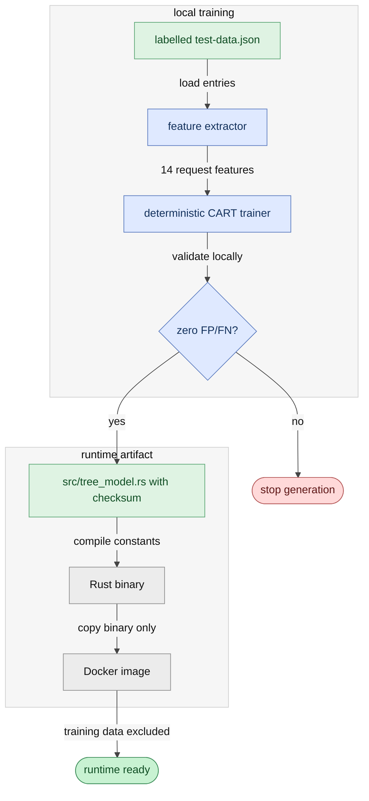

# rinha fraud

Fraud scoring for Rinha de Backend 2026, built around a tiny Rust runtime, a custom file-descriptor load balancer, and a locally generated decision tree.

### quickstart

```bash
docker compose up --build
curl -i http://127.0.0.1:9999/ready
```

### model generation

The runtime consumes a generated Rust tree committed at `src/tree_model.rs`. Rebuild it from labelled local data with:

```bash
python3 scripts/train_tree.py /tmp/rinha-resources/test-data.json src/tree_model.rs
```

The generator requires Python 3 with `numpy`. It extracts request features, trains a deterministic CART-style binary tree, and emits packed Rust nodes. The Docker image does not need the training data.

Diagram legend:

| class | use |
| --- | --- |
| `actor` | external client |
| `edge` | ingress or trust boundary |
| `core` | runtime process or binary |
| `work` | request parsing and scoring work |
| `data` | generated model or socket handoff data |
| `endok` / `enderr` | terminal outcome |



### architecture

| stage | hot-path work | key calls |
| --- | --- | --- |
| client to LB | Accept TCP on `:9999` and choose an API. | `accept4`, `sendmsg` |
| LB to API | Pass the accepted client socket over a Unix control socket. | `SCM_RIGHTS` |
| API parser | Read one HTTP message and scan only model fields. | `parse_fast_fields` |
| decision tree | Fill features lazily while walking generated thresholds. | `predict_with_lazy_features` |
| response | Return one of two prebuilt HTTP responses. | `HTTP_SCORE0`, `HTTP_SCORE5` |

```mermaid
%%{init: {"theme": "base", "themeVariables": {"fontFamily": "ui-sans-serif, system-ui, sans-serif", "primaryColor": "#ffffff", "primaryTextColor": "#111111", "primaryBorderColor": "#111111", "lineColor": "#444444", "textColor": "#111111", "secondaryColor": "#f6f6f6", "tertiaryColor": "#f6f6f6", "clusterBkg": "#f6f6f6", "clusterBorder": "#cfcfcf"}}}%%
flowchart LR
  subgraph CLIENT["client"]
    C["k6 / tester"]:::actor
  end

  subgraph LB["load balancer"]
    L["fd load balancer"]:::edge
    FD["accepted client fd"]:::core
  end

  subgraph API["api worker"]
    UDS["Unix control socket"]:::data
    EPOLL["epoll request loop"]:::core
    PARSER["body field scanner"]:::work
    FEATURES["lazy feature fill"]:::work
    TREE["packed decision tree"]:::work
    DECISION{"fraud?"}:::work
  end

  C -->|"HTTP :9999"| L
  L -->|"accept(2)"| FD
  FD -->|"SCM_RIGHTS"| UDS
  UDS -->|"fd handoff"| EPOLL
  EPOLL -->|"GET /ready"| OK(["200 ok"]):::endok
  EPOLL -->|"POST /fraud-score"| PARSER
  EPOLL -->|"other route"| MISS(["404"]):::enderr
  PARSER -->|"parsed"| FEATURES
  PARSER -->|"parse miss"| DEFAULT(["approve score 0"]):::endok
  FEATURES -->|"on-demand fields"| TREE
  TREE -->|"leaf reached"| DECISION
  DECISION -->|"yes"| DENY(["deny score 5"]):::endok
  DECISION -->|"no"| APPROVE(["approve score 0"]):::endok

  classDef actor fill:#111111,color:#ffffff,stroke:#111111,stroke-width:1px
  classDef edge fill:#ffffff,color:#111111,stroke:#111111,stroke-width:1px
  classDef core fill:#ececec,color:#111111,stroke:#8f8f8f,stroke-width:1px
  classDef work fill:#dfe9ff,color:#13315c,stroke:#5b7bbf,stroke-width:1px
  classDef data fill:#dff3e3,color:#0f4d23,stroke:#5da776,stroke-width:1px
  classDef endok fill:#c8f2d2,color:#0f4d23,stroke:#3f8f5b,stroke-width:1px
  classDef enderr fill:#ffd9d9,color:#5e1717,stroke:#b65b5b,stroke-width:1px
```



The load balancer does not inspect requests and does not score fraud. Its only job is accepting client sockets and distributing those already-accepted file descriptors between the two API containers. After the transfer, the API talks directly to the client socket.

### configuration

The compose defaults are tuned for the final 2 API + 1 LB topology:

| variable | default | purpose |
| --- | ---: | --- |
| `LB_MODE` | `fd` | final load balancer mode |
| `FD_SOCKET_DIR` | `/sockets` | API control socket directory |
| `API_EPOLL` | `1` | epoll request loop |
| `API_WORKERS` | `192` | preallocated API worker capacity |
| `MLOCK_CURRENT` | `0` | optional memory locking |
